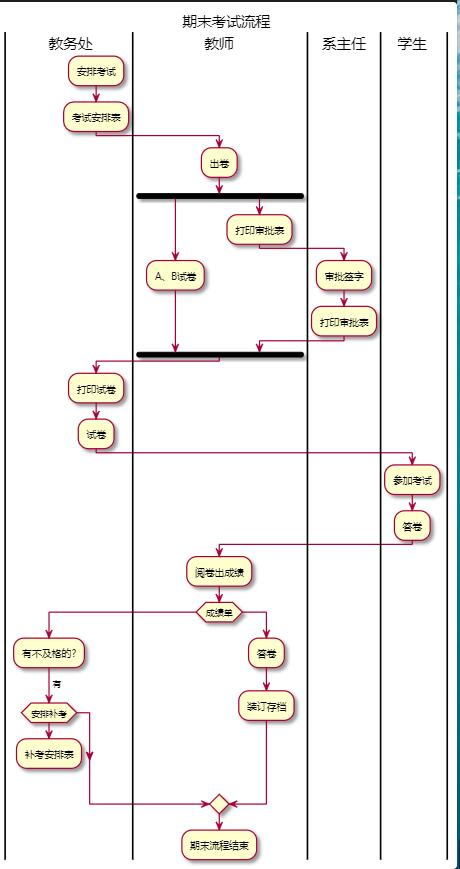
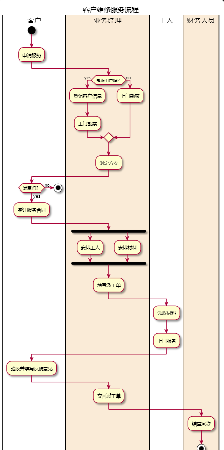

# 实验一： 业务流程建模
--学号：201710414118
--班级：1班
--姓名:王博
## 流程图1： 考试季成绩管理流程

### PlantUML代码：

```
@startuml
title 期末考试流程
|教务处|
:安排考试;
:考试安排表;
|教师|
:出卷;
fork
    :A、B试卷;
fork again
    :打印审批表;
    |系主任|
    :审批签字;
    :打印审批表;
    |教务处|
end fork
|教务处|
    :打印试卷;
    :试卷;
|学生|
:参加考试;
:答卷;
|教师|
:阅卷出成绩;
if(成绩单)
    |教务处|
    :有不及格的?;
    ->有;
    if(安排补考)
      :补考安排表;
    detach
    endif
  else
  |教师|
  :答卷;
  :装订存档;
  endif
:期末流程结束;
@enduml

```
### 业务流程图：


###  流程说明：
教务处安排考试，得到考试安排表，教师得到之后开始出卷AB试卷，同时打印审批表，给系主任审批签字，然后打印审批表，随后教务系统开始打印试卷，试卷打印完，学生就参加考试，答卷，学生答完试卷，教师开始阅卷，打印成绩单，一份给教务处看是否有不及格如果有安排补考后出补考时间表，另一份装订存档，整个期末考试流程结束。

## 流程图： 客服维修流程
### PlantUML代码：

```
@startuml
title:客户维修服务流程
|客户|
start
:申请服务;
|#AntiqueWhite|业务经理|
if (是新用户吗？) then (yes)
    :登记客户信息;
    :上门勘察;
else (no)
    :上门勘察;
endif
:制定方案;
|客户|
if (满意吗？) then (yes)
    :签订服务合同;
    |#AntiqueWhite|业务经理|
    fork
	:安排工人;
    fork again
	:安排材料;
    end fork
    :填写派工单;
    |工人|
    :领取材料;
    :上门服务;
    |客户|
    :验收并填写反馈意见;
    |#AntiqueWhite|业务经理|
    :交回派工单;
    |#AntiqueWhite|财务人员|
    :结算尾款;
    stop
|客户|
else (no)
    stop
@enduml
```

### 业务流程图：


### 流程说明：
客户首先申请服务，业务经理对其判断该用户是否是新用户，如果是则登记客户信息后上门勘察，如果不是则直接上门勘察，勘察后制定方案，客户收到方案后看是否满意，不满意则结束，满意则签订服务合同，业务经理收到合同后安排工人和安排材料，安排好后填写派工单，工人收到派工单则领取材料上门服务，工人完成后客户验收并填写反馈意见，业务经理交回派工单，财务人员结算尾款，整个流程结束。
