# 实验2：图书管理系统用例建模
|学号|班级|姓名|
|:-------:|:-------------: | :----------:|
|201710414118|软件(本)17-1|王博|
## 1. 图书管理系统的用例关系图

### 1.1 用例图PlantUML源码如下：

``` usecase
@startuml
usecase (编目)
usecase (图书检索)
usecase (借阅图书)
usecase (读者管理)
usecase (系统维护)
usecase (借书)
usecase (还书)
usecase (验证读者身份)
actor :采编员:
actor :读者:
actor :系统维护员:
actor :图书管理员:
:采编员: --> (编目)
:采编员: --> (图书检索)

:读者: --> (图书检索)
:读者: --> (借阅图书)

:图书管理员: --> (图书检索)
:图书管理员: --> (借阅图书)

:系统维护员: --> (读者管理)
:系统维护员: --> (系统维护)

(借阅图书) --> (借书) : <<include>>
(借阅图书) --> (还书) : <<include>>

(借书) --> (验证读者身份) : <<include>>
(借书) --> (验证读者身份) : <<include>>
@enduml
```


### 1.2. 用例图如下：

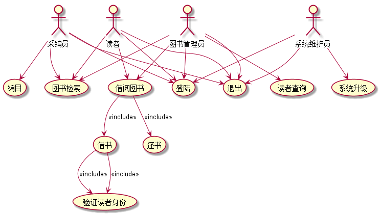

## 2. 参与者说明：

###     2.1 采编员

主要职责是：为图书馆购买新的图书并对图书进行编码

###     2.2 图书管理员

主要职责是：管理图书馆所有的书籍借出与归还

###     2.3 读者
    
主要职责是：在图书管中借阅图书与归还图书

###     2.4 系统维护员
    
主要职责是：在图书馆中管理读者与维护图书管理系统

##     3. 用例规约表
###     3.1 “编目”用例
####“编目”用例流程图源码如下
````
@startuml
start
:系统显示输入面板;
:输入书籍名字、编码、
存放地址、数量、存放时间;
if (没有输入名字？) then (yes)
  :提示没有输入名字;
    stop
elseif (没有输入存放地址？) then (yes)
  :提示没有输入存放地址;
  stop
elseif (没有输入数量？) then (yes)
  :提示没有输入数量;
    stop
else (no)
  :系统确认输入信息、
  保存并返回保存结果;
endif
if (参与者确认保存结果？) then (yes)
  :图书添加成功;
else (no)
  :取消添加;
endif
stop
@enduml
````
#### “编目”用例流程图
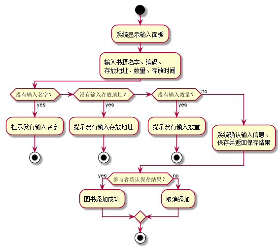

#### “编目”用例规约
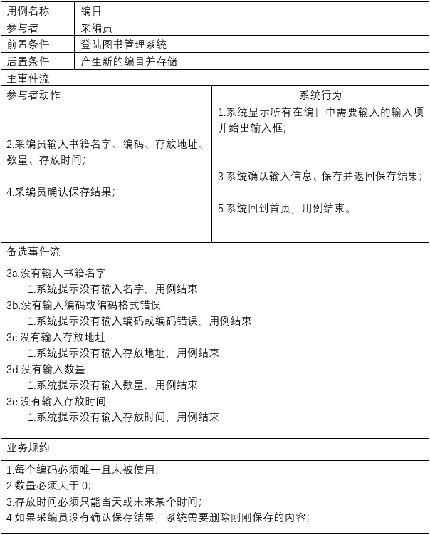
###     3.2 “图书检索”用例
#### “图书检索”用例流程图源码如下
````
@startuml
start
:系统显示图书搜索框;
if (选择名称查询？) then (yes)
  :系统使用名称查询;
else (no)
  :系统使用编码查询;
endif
:查询;
if (查询到内容？) then (yes)
  :系统返回查找的书籍并显示，存放地址，剩余数量;
else (no)
  :系统提示没有找到任何书籍;
endif
stop
@enduml
````
#### “图书检索”用例流程图
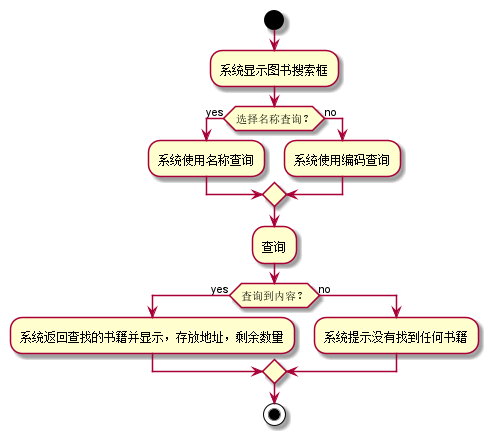

#### “图书检索”用例规约
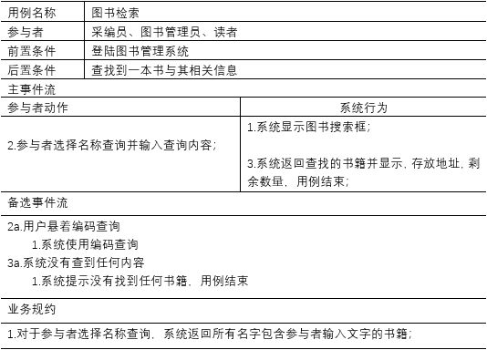
###     3.3 “借书”用例
**“借书”用例流程图源码如下：**
````
@startuml
start
:选择一本书;
:系统验证身份;
:锁定书籍;
if (所选书籍剩余量为0？) then (yes)
  :输出提示：书籍没有库存了;
    stop
elseif (达最大借书量？) then (yes)
  :提示已经到达最大借书量;
  stop
elseif (存在超过归还期限的书籍？) then (yes)
  :提示请先归还超时书籍;
    stop
else (no)
  :系统确认;
endif
:请求参与者确认;
if (用户确认？) then (yes)
  :借阅成功;
else (no)
  :取消借阅;
endif
stop
@enduml
````
#### “借书”用例流程图
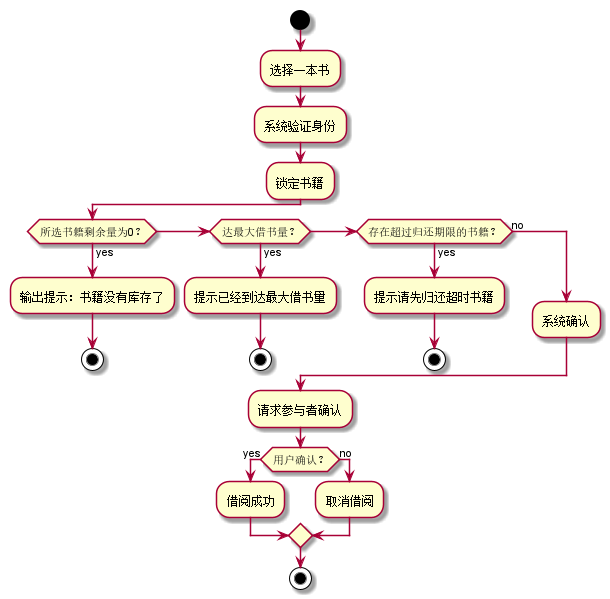

#### “借书”用例规约
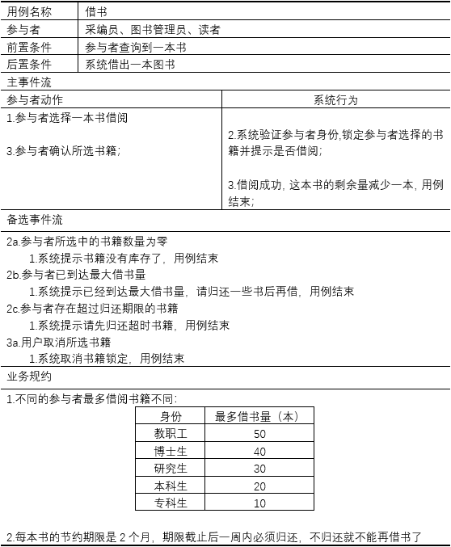
### 3.4 “还书”用例
####“”用例流程图源码如下
````
@startuml
start
:系统显示归还界面并提
示用户操作自动还书机;
:按照指导完成操作;
if (系统没有获得书籍信息？) then (yes)
  :提示请按照操作提示，规范使用还书机;
    stop
elseif (系统连续三次获取图书失败？) then (yes)
  :提示没有输入存放地址;
  if (系统提示还书出现错
  误是否呼叫工作人员？) then (yes)
  :已呼叫工作人员，请稍等;
  stop
    else (no)
    stop
  endif
  stop
elseif (参与者存在有超时的书籍？) then (yes)
  :提示用户请先归还超时书
  籍并显示所有已经超时的书籍;
    stop
else (no)
  :系统获得书籍信息、
  参与者信息并提示用户;
endif
if (参与者确认？) then (yes)
  :还书成功;
else (no)
  :取消还书;
endif
stop
@enduml
````
#### “还书”用例流程图
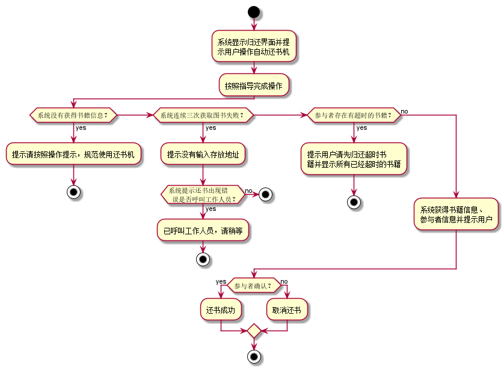

#### “还书”用例规约
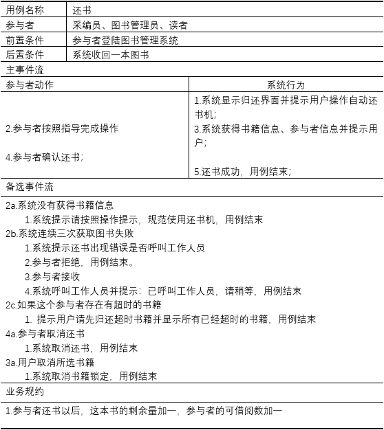
### 3.5 “读者查询”用例
####“读者查询”用例流程图源码如下
````
@startuml
start
:系统显示查询面板;
:参与者输入查询的用户名字;
if (查询到内容？) then (yes)
  :显示用户的名字，身份，
  已借书籍，超时书籍;
else (no)
  :没有查到这个用户;
endif
stop
@enduml
````
#### “读者查询”用例流程图
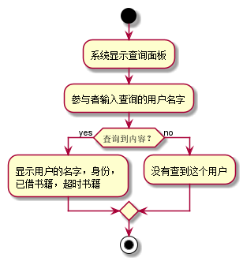

#### “读者查询”用例规约
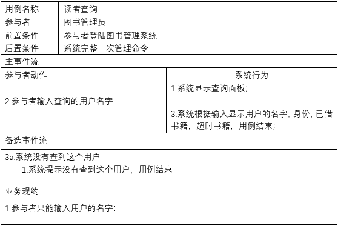
### 3.6 “登陆”用例
####“”用例流程图源码如下
````
@startuml
start
:系统显示登陆界面;
:参与者输入用户名，密码，验证码;
if (用户名输入错误？) then (yes)
  :系统提示用户或密码验证失败请重试;
    stop
elseif (密码输入错误？) then (yes)
  :系统提示用户或密码验证失败请重试;
  stop
elseif (验证码错误？) then (yes)
  :系统提示用户或密码验证失败请重试;
    stop
else (no)
  :系统验证信息成功，进入系统;
endif
stop
@enduml
````
#### “登陆”用例流程图
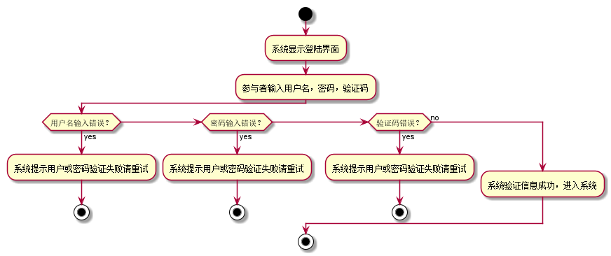

#### “登陆”用例规约
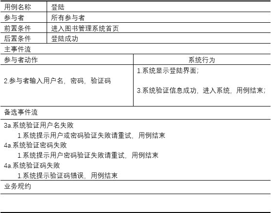
### 3.7 “系统升级”用例
####“”用例流程图源码如下
````
@startuml
start
:系统获取更新信息;
:参与者选择更新;
:系统进入更新，请求用户设置更新时间;
:系统确认时间，后台准备
等待更新;
:到达指定时间;
 if (更新成功？) then (yes)
  :提示更新成功;
else (no)
  :提示更新失败;
endif
stop
@enduml
````
#### “系统升级”用例流程图
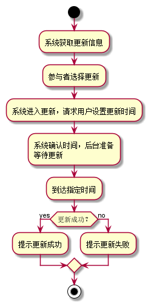

#### “系统升级”用例规约
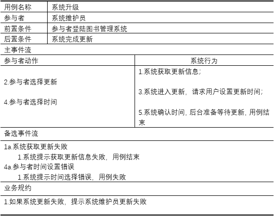
### 3. “读者查询”用例
####“”用例流程图源码如下
````
@startuml
start
:系统获取更新信息;
:参与者选择更新;
:系统进入更新，请求用户设置更新时间;
:系统确认时间，后台准备
等待更新;
:到达指定时间;
 if (更新成功？) then (yes)
  :提示更新成功;
else (no)
  :提示更新失败;
endif
stop
@enduml
````
#### “读者查询”用例流程图


#### “读者查询”用例规约


