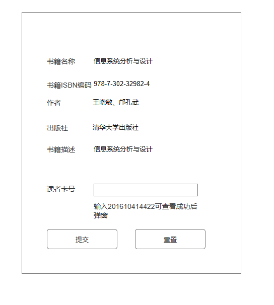
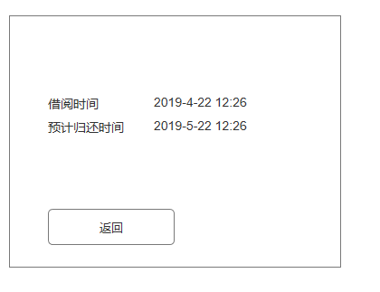
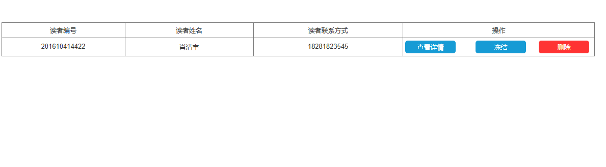
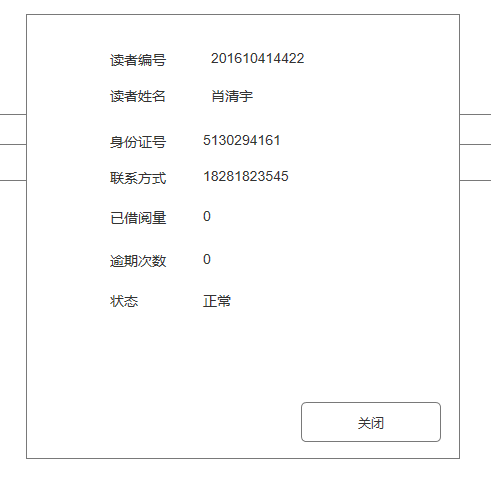
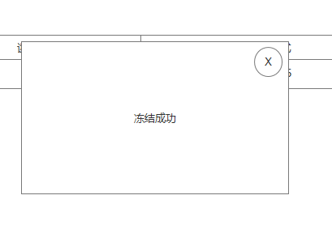

# 实验五 图书管理系统数据库设计与界面设计（老师示范）
## 1.数据库设计
### 1.1.管理员表
|字段|类型|主键、外键|可以为空|默认值|约束|说明|
|:---|:---|:---|:---|:---|:---|:---|
|id|varchar(100)|主键|否| | |职工号|
|name|varchar(100)| |否| | |姓名|
|rule|varchar(255)| |是| | |职工权限|
### 1.2.管理员权限表
|字段|类型|主键、外键|可以为空|默认值|约束|说明|
|:---|:---|:---|:---|:---|:---|:---|
|id|int(10)|主键|否| | |权限编号|
|name|varchar(100)| |否| | |权限名称|
|account|varchar(255)| |是| | |权限说明|
### 1.3.系统配置表
|字段|类型|主键、外键|可以为空|默认值|约束|说明|
|:---|:---|:---|:---|:---|:---|:---|
|borrow_max|int(2)| |否|1| |读者可同时借阅最大量|
|borrow_time|varchar(100)| |否| | |单次可借阅时间|
|renew_time|int(2)| |否|0| |读者单本书可续借次数|

### 1.4.图书表
|字段|类型|主键、外键|可以为空|默认值|约束|说明|
|:---|:---|:---|:---|:---|:---|:---|
|id|int(10)|主键|否| | |图书编号|
|name|varchar(255)| |否| | |图书名称|
|stock|int(10)| |否|0| |当前图书库存|
|borrow_num|int(10)| |否|0| |图书已借阅量|

### 1.5.图书类型表
|字段|类型|主键、外键|可以为空|默认值|约束|说明|
|:---|:---|:---|:---|:---|:---|:---|
|id|int(10)|主键|否| | |图书类型编号|
|name|varchar(100)| |否| | |图书类型名称|
### 1.6.图书资源与类型匹配表
|字段|类型|主键、外键|可以为空|默认值|约束|说明|
|:---|:---|:---|:---|:---|:---|:---|
|book_id|int(10)|外键|否| |图书表图书编号关联|图书编号|
|type_id|int(10)|外键|否| |图书类型表类型编号关联|图书类型编号|
### 1.7.图书品种表
|字段|类型|主键、外键|可以为空|默认值|约束|说明|
|:---|:---|:---|:---|:---|:---|:---|
|book_id|int(10)|外键|否| | |图书编号|
|isbn|varchar(100)|主键|否| | |图书国际编码|
|author|varchar(100)| |否| | |图书作者|
|price|double| |否| | |图书价格|
|simple_account|varchar(255)| |是| | |图书简介|
|press|varchar(255)| |否| | |出版社|
|pubdate|datetime| |否| | |出版日期|
|version|int(10)| |否| | |图书版本|

### 1.8.资源记录表
|字段|类型|主键、外键|可以为空|默认值|约束|说明|
|:---|:---|:---|:---|:---|:---|:---|
|id|varchar(100)|主键|否| | |资源记录编号|
|time|datetime| |否| | |资源记录建立时间|
|type_id|int(10)|外键|否| |资源类型表编号关联|资源类型编号|
|详细记录编号|varchar(100)| |否| |资源类型加详细资源记录编号，中间用.隔开|资源详细记录|

### 1.9.资源类型表
|字段|类型|主键、外键|可以为空|默认值|约束|说明|
|:---|:---|:---|:---|:---|:---|:---|
|id|int(10)|主键|否| | |资源类型编号|
|name|varchar(100)| |否| | |资源类型名称|

### 1.10.读者信息表
|字段|类型|主键、外键|可以为空|默认值|约束|说明|
|:---|:---|:---|:---|:---|:---|:---|
|id|varchar(100)|主键|否| | |编号|
|name|varchar(100)| |否| | |姓名|
|idnumber|varchar(16)| |否| | |身份证号|
|tel|varchar(100)| |否| | |联系方式|
|borrowed_num|int(10)| |否|0| |已借阅量|
|overtime_num|int(10)| |否|0| |逾期次数|

### 1.11.预定记录表
|字段|类型|主键、外键|可以为空|默认值|约束|说明|
|:---|:---|:---|:---|:---|:---|:---|
|id|int(10)|主键|否| | |编号|
|user_id|varchar(100)|外键|否| |读者信息表编号关联|读者编号|
|book_isbn|varchar(100)|外键|否| |图书信息表编号关联|图书编号|
|time|datetime| |否| | |预定时间|

### 1.12.借阅记录表
|字段|类型|主键、外键|可以为空|默认值|约束|说明|
|:---|:---|:---|:---|:---|:---|:---|
|id|int(10)|主键|否| | |编号|
|admin_id|varchar(100)|外键|否| |管理员信息表编号关联|管理员编号|
|user_id|varchar(100)|外键|否| |读者信息表编号关联|读者编号|
|book_isbn|varchar(100)|外键|否| |图书信息表编号关联|图书编号|
|time|datetime| |否| | |借阅时间|
|return_time|datetime| |否| | |归还时间|

### 1.13.逾期记录表
|字段|类型|主键、外键|可以为空|默认值|约束|说明|
|:---|:---|:---|:---|:---|:---|:---|
|id|int(10)|主键|否| | |编号|
|time|varchar(100)| |否| | |逾期时间|
|borrow_id|int(10)|外键|否| |借阅记录表编号关联|借阅记录编号|
|finerule_id|int(10)|外键|否| |罚款细则表编号关联|罚款细则编号|
|fine|double| |否| | |罚款|

### 1.14.罚款细则表
|字段|类型|主键、外键|可以为空|默认值|约束|说明|
|:---|:---|:---|:---|:---|:---|:---|
|id|int(10)|主键|否| | |编号|
|rule|varchar(255)| |否| | |罚款规则|

## 2.界面设计
### 2.1界面设计github仓库地址
   [ui展示](https://everythingtomyheart.github.io/is_analysis_pages/)
### 2.2 界面设计图
#### 2.2.1 借阅图书界面设计图
##### 借阅图书填写界面截图

##### 借阅图书借阅成功界面截图

#### 2.2.2 读者管理界面设计图
##### 读者管理表格界面截图

##### 读者管理查看详情界面截图

##### 读者管理冻结界面截图


## 3.api设计
### 3.1 借阅图书api设计
#### 3.1.1 查询图书信息
- 功能：查询读者借阅图书信息
- 请求地址： http://[YOUR_DOMAIN]/v1/api/borrow_book_info
- 请求方法：POST
- 请求参数：

|参数名称|必填|说明|
|:-------:|:-------------: | :----------:|
|access_token|是|用于验证请求合法性的认证信息。 |
|method|是|默认为 get。|

- 返回实例：
```
{
    "msg": "查询成功",
    "data": {
        "id": "1",
        "name": "信息系统分析与设计",
        "stock": 12,
        "borrow_num": "12",
        vaieity:[{
        "isbn":123,
        "author":"xiao",
        "price:32,
        "press":"清华大学出版社",
        "version":1
        }]
        },
    "code": 200
}
```
- 返回参数说明：
    
|参数名称|说明|
|:-------:|:-------------: |
|msg|返回信息|
|data|查询到的书籍信息|
|code|返回状态码|

#### 3.1.2 借阅图书
- 功能：借阅图书
- 请求地址： http://[YOUR_DOMAIN]/v1/api/borrow_book
- 请求方法：POST
- 请求参数：

|参数名称|必填|说明|
|:-------:|:-------------: | :----------:|
|access_token|是|用于验证请求合法性的认证信息。 |
|method|是|默认为 get。|
|bookid|是|借阅图书id|
|userid|是|读者编号|

- 返回实例：
```
{
    "msg": "借阅成功",
    "data": {
        "time": "2019-4-22",
        "return_time": "2019-5-22",
        },
    "code": 200
}
```
- 返回参数说明：
    
|参数名称|说明|
|:-------:|:-------------: |
|msg|返回信息|
|data|借阅处理成功后返回的借阅信息|
|code|返回状态码|

## 3.2 读者信息管理api设计
#### 3.2.1 查询读者信息
- 功能：查询读者信息
- 请求地址： http://[YOUR_DOMAIN]/v1/api/user_info
- 请求方法：POST
- 请求参数：

|参数名称|必填|说明|
|:-------:|:-------------: | :----------:|
|access_token|是|用于验证请求合法性的认证信息。 |
|method|是|默认为 get。|

- 返回实例：
```
{
    "msg": "查询成功",
    "data": [{
                     "id": "1",
                     "name": "肖",
                     "idnumber":1243,
                     "tel":123
             }],
    "code": 200
}
```
- 返回参数说明：
    
|参数名称|说明|
|:-------:|:-------------: |
|msg|返回信息|
|data|查询到的读者信息|
|code|返回状态码|    

#### 3.2.2 冻结读者
- 功能：冻结读者，更改读者状态
- 请求地址： http://[YOUR_DOMAIN]/v1/api/freeze_user
- 请求方法：POST
- 请求参数：

|参数名称|必填|说明|
|:-------:|:-------------: | :----------:|
|access_token|是|用于验证请求合法性的认证信息。 |
|method|是|默认为 get。|
|userid|是|需要冻结的读者id|
- 返回实例：
```
{
    "msg": "冻结成功",
    "code": 200
}
```
- 返回参数说明：
    
|参数名称|说明|
|:-------:|:-------------: |
|msg|返回信息|
|code|返回状态码| 

#### 3.2.3 删除读者
- 功能：删除读者，从图书管理系统中去除读者
- 请求地址： http://[YOUR_DOMAIN]/v1/api/freeze_user
- 请求方法：POST
- 请求参数：

|参数名称|必填|说明|
|:-------:|:-------------: | :----------:|
|access_token|是|用于验证请求合法性的认证信息。 |
|method|是|默认为 get。|
|userid|是|需要删除的读者id|
- 返回实例：
```
{
    "msg": "删除成功",
    "code": 200
}
```
- 返回参数说明：
    
|参数名称|说明|
|:-------:|:-------------: |
|msg|返回信息|
|code|返回状态码|   