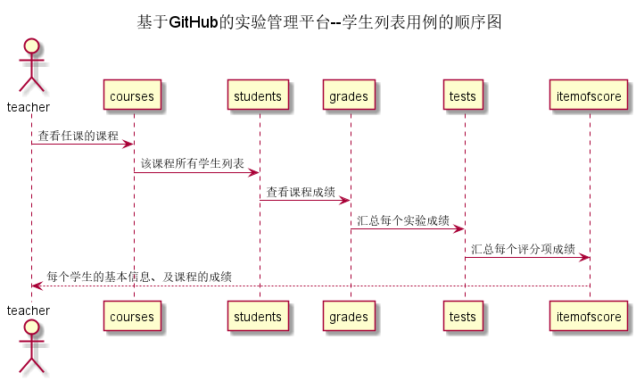

# “学生列表”用例 [返回](../README.md)
## 1. 用例规约

|用例名称|学生列表|
|-------|:-------------|
|功能|以表形式的显示出所有学生的信息|
|参与者|老师|
|前置条件|老师需要先登录，需要选择当前学期以及课程信息|
|后置条件| |
|主事件流|  |
|备选事件流| |

## 2. 业务流程（顺序图） [源码](../src/sequence学生列表.puml)
 

## 3. 界面设计
- 界面参照: https://miss-pw.github.io/is_analysis/test6/ui/index.html
- API接口调用
    - 接口1：[getStudents](../接口/getStudents.md) 

## 4. 算法描述

- WEB_SUM解析为列表  
  - WEB_SUM是接口getStudents的返回值中的一部分，形如："WEB_SUM": "Y"。需要在前端进行解析。  
  - 作用是判断GitHub网址是否正确，Y代表正确，N代表不正确。  
  - 当网址出现问题，可以通过点击实验详情，了解具体信息。
  
- result_sum解析为列表
    - result_sum是接口getStudents的返回值中的一部分，形如："result_sum": "100"。需要在前端进行解析。
    - 成绩汇总（来自CGRADES表），这是系统通过计算每个实验成绩以及平时成绩以一定的权重计算得来。
    
## 5. 参照表

- [STUDENTS](../数据库设计.md/#STUDENTS)
- [CGRADES](../数据库设计.md/#CGRADES)
- [TESTS](../数据库设计.md/#TESTS)
- [COURSE](../数据库设计.md/#COURSE)
- [EXGRADES](../数据库设计.md/#EXGRADES)
- [ITEMOFSCORE](../数据库设计.md/#ITEMOFSCORE)

